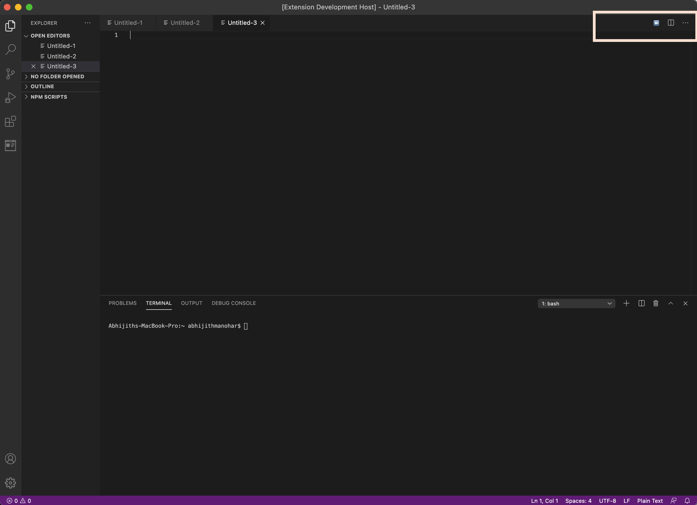

# README

## Features

Plugin provides 'Back' button to navigate back to previous active text editor file

## Use Case

Provides way to navigate back to source text editor file after "drilling" into a method which takes user to a different file

## Release Notes

### 1.0.0

Initial release of file-vigation plugin
